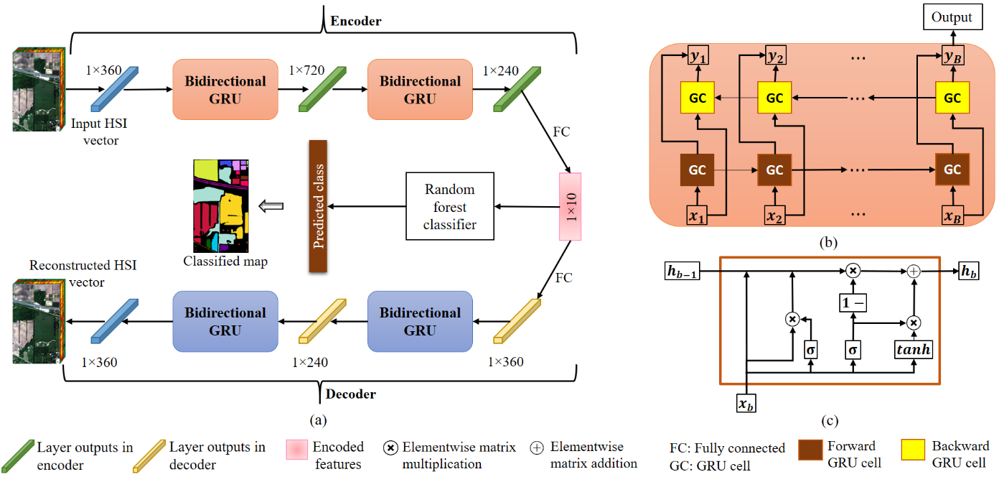

# Bidirectional-GRU-Based-Autoencoder-for-Dimensionality-Reduction-in-Hyperspectral-Images
Hyperspectral images (HSI) are being extensively used in land use/land cover classification because they possess high spectral resolution. Although, this leads to better reflectance distinguishability, the problem of high dimensionality also occurs, making the algorithms data greedy. To counter it, deep learning models, such as autoencoders, are being used. To exploit the contiguous nature of HSIs, sequential models like recurrent neural network (RNNs) are adopted. However, for longer sequences, RNNs exhibit vanishing gradients. Also, they fail to incorporate the future information, limiting their scope. Hence, we propose a Bidirectional Gated Recurrent Unit based autoencoder (BiGRUAE), to project the high dimensional features to a low dimensional space. The bidirectional nature captures the information, both from past and future states, while the gating mechanism of GRU prevents the vanishing gradient. We evaluate our method on two hyperspectral datasets, namely, Indian pines 2010 and Salinas, where our method surpasses the benchmark methods.



# URL to the paper: 
>[Paper](https://ieeexplore.ieee.org/stamp/stamp.jsp?arnumber=9555048)

# Requirement:

```
Tensorflow 2
```
# Steps:

```
1. Download the dataset from the provided URL in data folder
```
```
2. Run data_prepare.py
```
```
3. Run model_fbae.py
```
# Citation

If using the concept or code, kindly cite the paper as: 
>S. Pande, B. Banerjee. Bidirectional GRU based autoencoder for dimensionality reduction in hyperspectral images. IEEE International Geoscience and Remote Sensing Symposium (IGARSS), July, 2021.

You can also use the bibtex as:
```
@inproceedings{pande2022feedback,
  title={Bidirectional GRU based autoencoder for dimensionality reduction in hyperspectral images},
  author={Pande, Shivam and Banerjee, Biplab},
  booktitle={IGARSS 2022-2022 IEEE International Geoscience and Remote Sensing Symposium},
  pages={147--150},
  year={2022},
  organization={IEEE}
}
```
